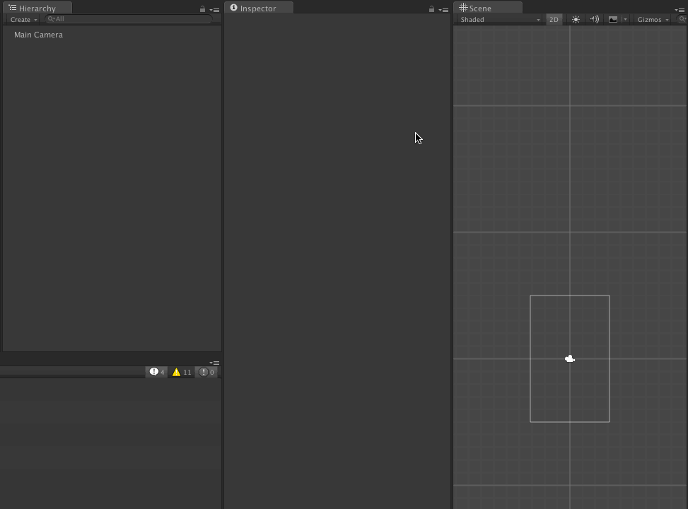

# DDDMusic

Play music with Intros and Outros on Unity.

## Install

Import unitypackage.

## Usage

### Sections

1. Create an AudioSource object on your scene.
1. Set AudioClip on the object.
1. Add Music component to the object.
1. Define sections which the AudioClip will be separated into.
1. Call `Play` method on Music (or you can enable `Play On Awake` for the AudioSource)

### Transitions

- Through: Move to the next section at the end of the current section.
- Loop: Move to the beginning of the current section at the end.
- End: Stop playing at the end.

## License

MIT
